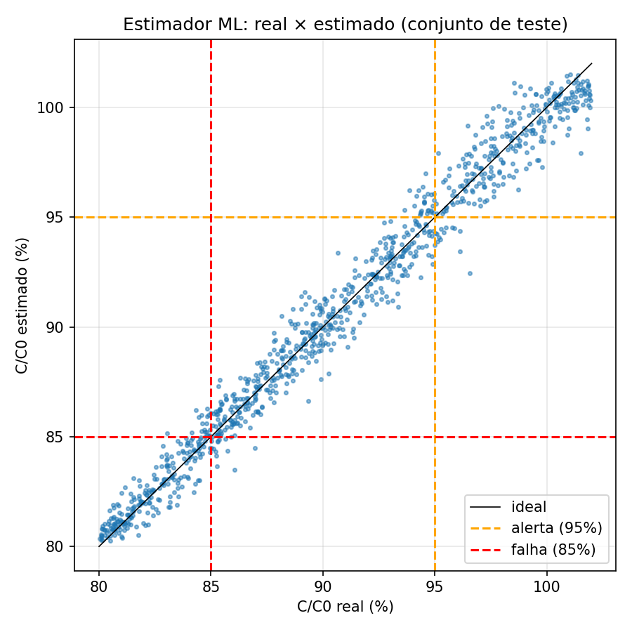

# Gêmeo digital do capacitor de motor monofásico

> **Objetivo:** construir um gêmeo digital que detecta, **só pelas correntes do motor**, que o capacitor de um motor de ventilador PSC está perdendo capacitância, **antes de ele falhar**.

Motores monofásicos com capacitor permanente (PSC) estão em ventiladores, ar-condicionado e lavadoras. O capacitor desgasta aos poucos e, hoje, a falha só é percebida quando o motor já não funciona direito. Este projeto combina um **modelo físico do motor** com um **modelo de machine learning** para estimar a saúde do capacitor com o motor ligado, usando só sinais que um sensor de corrente barato mede.



## Resultados até agora

**1. O capacitor aparece nas correntes** (Sprint 1). No motor de referência, validado contra medições publicadas com erro de 3 a 6%, uma queda de 5% na capacitância reduz a corrente do enrolamento principal em **4,15%** e aumenta a defasagem entre as correntes em **2,8°**.

**2. Uma IA estima o capacitor pelas correntes** (Sprint 2, versão mínima). Uma floresta aleatória (scikit-learn) recebe tensão, as duas correntes e a defasagem, e prevê quanto de capacitância sobrou. Treinada em 4.000 motores simulados, com tensão da rede variando ±10%, cobre de 20 a 70 °C e ruído de sensor, e testada em 1.000 casos nunca vistos:

| | IA (4 medições) | Linha de base (só uma corrente) |
|---|---|---|
| Erro médio da capacitância estimada | **0,70 ponto percentual** | 4,87 pontos |
| Acurácia saudável / alerta / falha | **92,7%** | 49,9% |
| Alarme falso | **4,7%** | 57% |

Nenhum capacitor em falha foi classificado como saudável. A comparação mostra onde a IA ganha o seu lugar: **separar o efeito do capacitor do efeito da tensão e da temperatura**, que também mexem nas correntes.

**Critério:** alerta quando a capacitância cai 5%; falha em 15%, alinhado à norma IEC 60252-1 ([ADR 0004](docs/adr/0004-criterio-alerta-falha.md)).

**Limites honestos:** tudo é simulação; o motor virtual foi validado contra um motor real publicado, mas o gêmeo ainda não viu uma máquina física. A carga do motor (escorregamento) ainda está fixa.

## Como rodar

```bash
git clone https://github.com/jfmiglionari/gemeo-digital-capacitor.git
cd gemeo-digital-capacitor
python3 -m venv .venv
source .venv/bin/activate
pip install -e ".[dev]"

pytest                                            # valida o modelo do motor e a IA
python experimentos/etapa1_sensibilidade.py       # Sprint 1: sensibilidade ao capacitor
python experimentos/sprint2_treino_ml.py          # Sprint 2: gera os dados, treina e avalia a IA
```

Os gráficos e as métricas são gravados em `resultados/`.

## Como o projeto está organizado

```
src/gemeo_capacitor/
├── planta/      motor PSC simulado (modelo de Ghial et al., 2014)
├── medicao/     sensores com ruído
├── gemeo/       estimador de machine learning
experimentos/    scripts de cada sprint
resultados/      gráficos e métricas
docs/            arquitetura, decisões (ADRs), validação e roadmap
```

O gêmeo nunca lê o valor verdadeiro do capacitor: tudo chega pela camada de medição, como seria numa máquina real ([ADR 0002](docs/adr/0002-planta-atras-de-interface.md)).

## Por que isso não é óbvio

- O modelo do motor PSC com o capacitor existe (Ghial et al., 2014), mas é usado **offline**. Ao reproduzi-lo, as equações intermediárias publicadas não fecharam com a medição; o projeto usa as impedâncias finais do artigo ([ADR 0005](docs/adr/0005-planta-calibrada-tabela-iii.md)).
- Estimar capacitância **online** já foi feito, mas em **conversores eletrônicos** (Ghadrdan et al., 2023; Ribeiro et al., 2025), não em motores.
- O trabalho mais próximo em motor monofásico (Shukla et al., 2025) detecta apenas o capacitor **removido**, não a degradação gradual.

## Documentação

| Documento | Conteúdo |
|---|---|
| [Visão geral](docs/00-visao-geral.md) | Objetivo, escopo, o que está fora do escopo |
| [Arquitetura](docs/01-arquitetura.md) | Camadas, componentes, fluxo de dados, interfaces |
| [Fontes de dados](docs/02-fontes-de-dados.md) | De onde vem cada número usado na simulação |
| [Modelo matemático](docs/03-modelo-matematico.md) | Equações do motor e do capacitor |
| [Modelo de falhas](docs/04-modelo-de-falhas.md) | Como o capacitor degrada e quando é considerado falho |
| [Plano de validação](docs/05-plano-de-validacao.md) | Como sabemos que o gêmeo funciona |
| [Decisões (ADRs)](docs/adr/) | Registro das decisões de arquitetura e por quê |
| [Metodologia](docs/06-metodologia.md) | Sprints com portão e papéis |
| [Roadmap](docs/roadmap.md) | Sprints e resultados |
| [Referências](docs/referencias.md) | Artigos usados |

## Stack

Python 3 · NumPy · SciPy · Matplotlib · scikit-learn · pytest.

---

## English summary

A digital twin that estimates, **from motor currents alone**, how much capacitance the run capacitor of a PSC fan motor has lost, **before it fails**. A physics model of the motor (Ghial et al., 2014, validated against published measurements within 3–6%) generates training data; a random forest (scikit-learn) trained on voltage, both winding currents and their phase difference estimates C/C0 with a **0.70 percentage-point mean error** and **92.7% accuracy** in healthy / warning / failure classes, under ±10% grid voltage, 20–70 °C copper temperature and sensor noise. A single-current baseline reaches only 49.9%. Simulation only for now. Documentation in Portuguese.

## Licença / License

MIT — ver [LICENSE](LICENSE).
