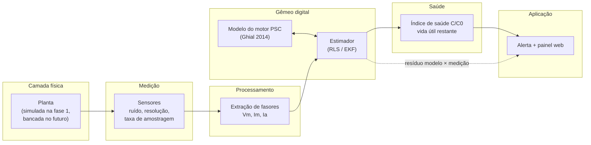

# Arquitetura

A arquitetura segue as camadas de gêmeo digital propostas por Dhamo et al. (2026) para acionamentos elétricos, e respeita os três requisitos que esses autores usam para distinguir um gêmeo digital de verdade de uma simulação:

1. o modelo virtual é **atualizado com dados medidos**;
2. a **sincronização** entre modelo e máquina é avaliada;
3. a camada de aplicação **gera uma decisão** (alerta, recomendação).

## Visão em camadas



## Componentes

| Camada | Módulo | Responsabilidade | Entrada → saída |
|---|---|---|---|
| Física | `planta/` | Representa a máquina real. Na fase 1 é um simulador que conhece o C verdadeiro. | cenário (C(t), carga, tensão) → grandezas "reais" |
| Medição | `medicao/` | Transforma grandezas reais no que um sensor entregaria: ruído, quantização, erro de ganho, taxa de amostragem. | grandezas reais → amostras |
| Processamento | `processamento/` | Extrai amplitude e fase de cada sinal (fasores) a partir das amostras. | amostras → fasores Vm, Im, Ia |
| Gêmeo | `gemeo/modelo.py` | Mesmas equações do motor, mas com parâmetros **estimados**. | parâmetros + tensão + escorregamento → correntes previstas |
| Gêmeo | `gemeo/estimador.py` | Ajusta C (e Rc) para que o modelo reproduza as correntes medidas. | fasores medidos → C estimado + incerteza |
| Saúde | `saude/` | Converte C estimado em índice de saúde e vida útil restante. | C(t) estimado → C/C0, tendência, vida restante |
| Aplicação | `app/` | Decide e mostra: alerta quando C/C0 se aproxima de 95%; painel interativo. | saúde → alerta, gráficos |

## Regra de fronteira (a mais importante)

**O gêmeo nunca lê o C verdadeiro da planta.** Tudo o que ele sabe chega pela camada de medição. Isso evita "trapaça" na simulação e garante que, quando a planta simulada for trocada por uma bancada real, nada no gêmeo precise mudar. Ver [ADR 0002](adr/0002-planta-atras-de-interface.md).

## Interfaces

```python
class Planta(Protocol):
    def amostrar(self, duracao_s: float) -> Amostras: ...
    # Amostras: tempo, v_rede, i_principal, i_auxiliar (e velocidade, se houver)

class Estimador(Protocol):
    def atualizar(self, fasores: Fasores) -> EstadoEstimado: ...
    # EstadoEstimado: C, Rc, incerteza, resíduo
```

A planta simulada e a futura bancada implementam a mesma interface `Planta`.

## Estrutura do repositório

```
gemeo-digital-capacitor/
├── docs/                 documentação (este diretório)
│   └── adr/              decisões de arquitetura
├── src/gemeo_capacitor/
│   ├── planta/           motor PSC simulado + modelo de degradação do capacitor
│   ├── medicao/          modelo dos sensores
│   ├── processamento/    extração de fasores
│   ├── gemeo/            modelo + estimador
│   ├── saude/            índice de saúde e vida útil
│   └── app/              painel web
├── dados/referencia/     parâmetros de motores e capacitores, com fonte
├── experimentos/         scripts de cada etapa (ex.: etapa 1 — viabilidade)
├── resultados/           gráficos e tabelas gerados
└── tests/                testes (inclui reproduzir o artigo do Ghial)
```

## Qualidade

- **Rastreabilidade:** todo número em `dados/referencia/` aponta para a fonte (artigo, tabela, página). Ver [Fontes de dados](02-fontes-de-dados.md).
- **Reprodutibilidade:** cada experimento é um script que regenera seus gráficos do zero.
- **Validação antes de uso:** o modelo só é usado depois de reproduzir os valores medidos no artigo de origem (teste automatizado).
